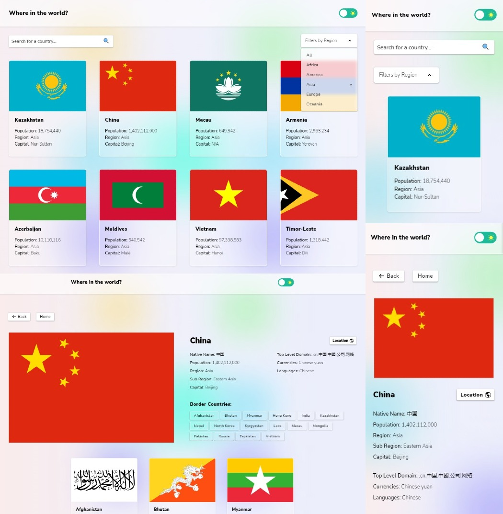

# Frontend Mentor - REST Countries API with theme switcher

This is my solution to the [REST Countries API with theme switcher](https://www.frontendmentor.io/challenges/rest-countries-api-with-color-theme-switcher-5cacc469fec04111f7b848ca)

## The challenge

Users should be able to:

- See all countries from the API on the homepage
- Search for a country using an `input` field
- Filter countries by region
- Click on a country to see more detailed information on a separate page
- Click through to the border countries on the detail page
- Toggle the color scheme between light and dark mode _(optional)_

### Links

- Solution URL: [Add solution URL here](https://www.frontendmentor.io/challenges/rest-countries-api-with-color-theme-switcher-5cacc469fec04111f7b848ca)
- Live Site URL: [Add live site URL here](https://jhon-okayda-countries-project.vercel.app)

### Built with

- Mobile-first (Layout)
- Next-JS
- React-JS
- SCSS-Modules
- BEM-Methodology
- Framer-Motion (animation)
- Zustand (state-management)

## Author

- Created by - okayda-jhon
